# Proyecto Frontend

## Instalación y configuración

1. Dentro de una consola en este directorio, instalar las dependencias

    ```bash
    npm install
    ```
    ó
    ```bash
    yarn install
    ```

2. Una vez instaladas todas las dependencias, inicializar el proyecto 

    ```bash
    npm start
    ```
    ó
    ```bash
    yarn start
    ```

## Documentación

### Usuario

#### Registro

Para poder registrarse, se debera ingresar al boton de "Registrarse" en el navbar.

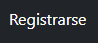

Una vez dentro, se deberá llenar el formulario de registro y darle a "Registrarse".

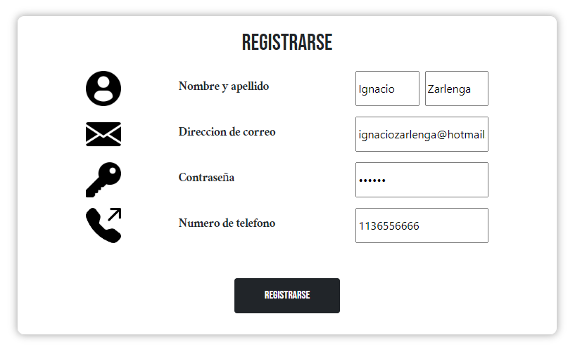

Al registrarse, nos llegará un email con la información de nuestra cuenta.

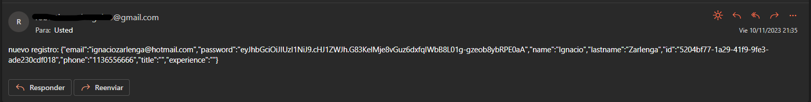

#### Login

Para loguearse, se debera ingresar al boton de "Loguearse" en el navbar.

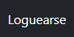

Una vez dentro, se deberá llenar el formulario de logueo y darle a "Loguearse".

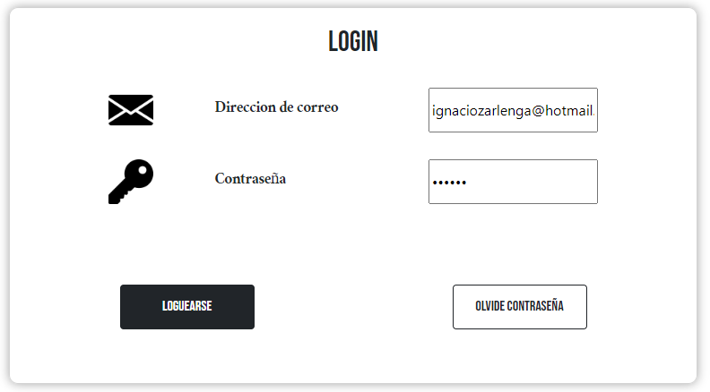

#### Reinicio de contraseña

En caso de no recordar la contraseña, se puede resetear la contraseña a "default" haciendo click en "Olvide Contraseña". Se debera llenar el campo del email para poder enviar el mail de reinicio de contraseña.

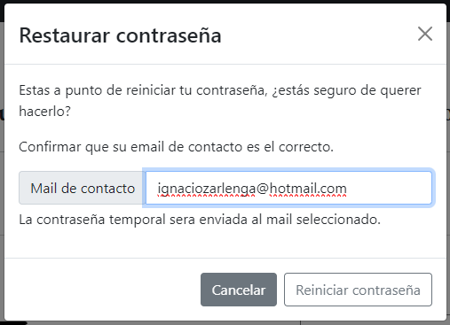
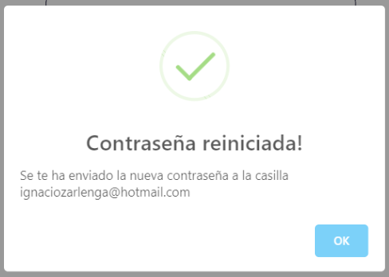
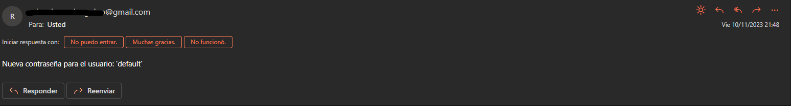

#### Edición de usuario

Se debera ingresar al boton de "Usuario" de la navbar.

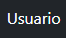

Una vez dentro, podremos editar todos los campos que querramos. Una vez hecho esto, podremos darle a "Cambiar datos" para que se apliquen dichos cambios.

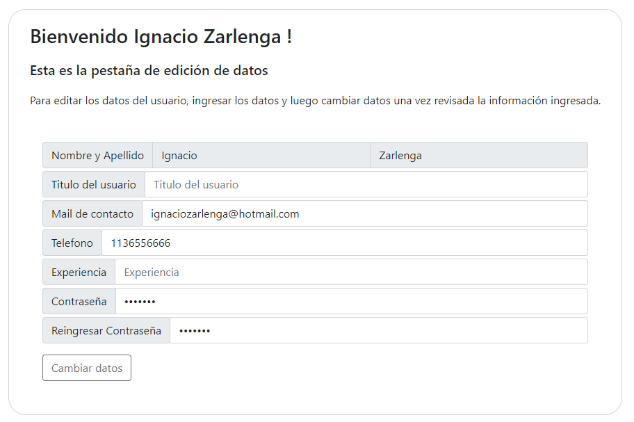

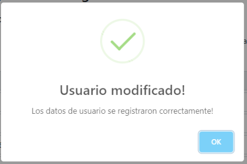

#### Creacion de servicios

Para crear nuestros propios servicios, podemos dirigirnos a "Mis Servicios". 

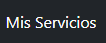

Una vez ahi, notaremos que no tenemos ningun servicio creado, por lo que clickearemos en "Crear nuevo servicio".

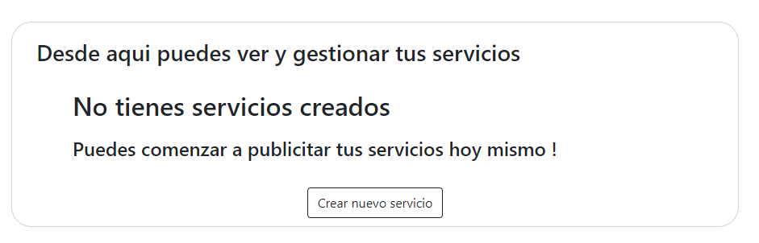

Una vez rellenado el formulario del servicio, daremos en crear y tendremos nuestro servicio creado (Puede estar publicado o no en base al marcador del formulario)

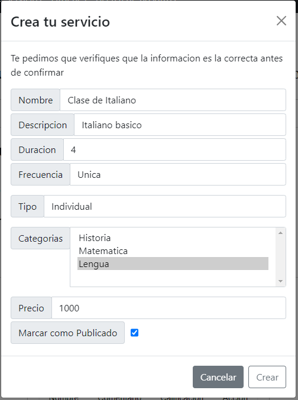
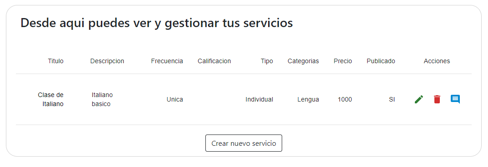

### Busqueda de servicios

Para la busqueda de servicios tendremos que ir a la seccion de 

