# Proyecto Frontend

## Instalación y configuración

1. Dentro de una consola en este directorio, instalar las dependencias

    ```bash
    npm install
    ```
    ó
    ```bash
    yarn install
    ```

2. Una vez instaladas todas las dependencias, inicializar el proyecto 

    ```bash
    npm start
    ```
    ó
    ```bash
    yarn start
    ```

## Documentación

### Usuario

#### Registro

Para poder registrarse, se debera ingresar al boton de "Registrarse" en el navbar.


Una vez dentro, se deberá llenar el formulario de registro y darle a "Registrarse".


Al registrarse, nos llegará un email con la información de nuestra cuenta.


#### Login

Para loguearse, se debera ingresar al boton de "Loguearse" en el navbar.


Una vez dentro, se deberá llenar el formulario de logueo y darle a "Loguearse".


#### Reinicio de contraseña

En caso de no recordar la contraseña, se puede resetear la contraseña a "default" haciendo click en "Olvide Contraseña". Se debera llenar el campo del email para poder enviar el mail de reinicio de contraseña.


#### Edición de usuario

Se debera ingresar al boton de "Usuario" de la navbar.


Una vez dentro, podremos editar todos los campos que querramos. Una vez hecho esto, podremos darle a "Cambiar datos" para que se apliquen dichos cambios.


#### Creacion de servicios

Para crear nuestros propios servicios, podemos dirigirnos a "Mis Servicios". 


Una vez ahi, notaremos que no tenemos ningun servicio creado, por lo que clickearemos en "Crear nuevo servicio".


Una vez rellenado el formulario del servicio, daremos en crear y tendremos nuestro servicio creado (Puede estar publicado o no en base al marcador del formulario)


#### Manejo de Ordenes

Para poder hacer manejo de las ordenes entrantes, iremos a "Ordenes".

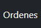

Dentro, se irán cargando todas las solicitudes con su estado actual y botones para poder hacer manejo de dicha orden.

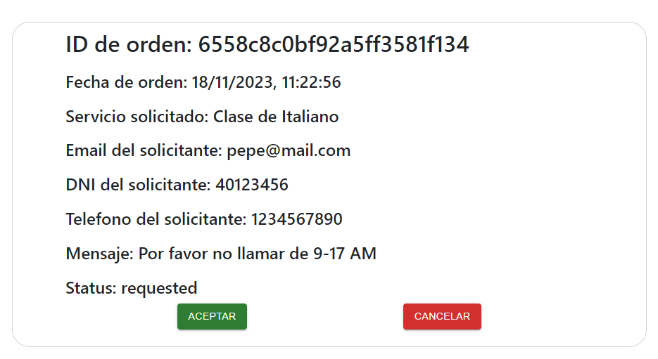

En caso de querer cancelar la orden, daremos click en cancelar y pasará al estado de "Cancelled".

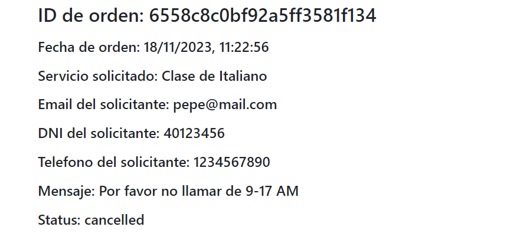

Ahora, en caso de querer aceptar la orden entrante, daremos click en cancelar y pasará al estado de "Approved".

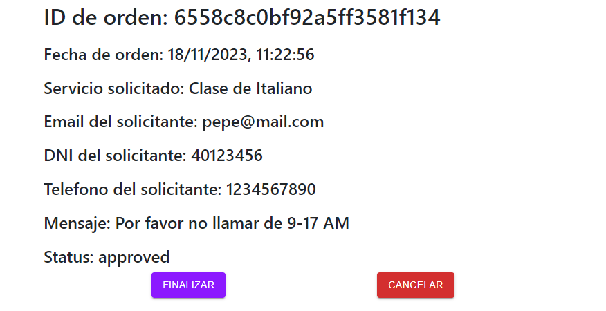

Luego, podremos finalizar la orden una vez que se finalice el curso, o bien se podrá cancelar el curso en caso de que en la mitad del servicio el solicitante decida darse de baja del mismo. Al darle a "Finalizar", el estado de la orden pasará a "Done".

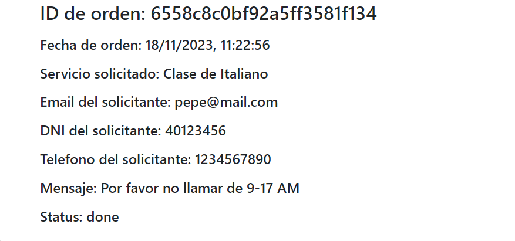


#### Manejo de Comentarios

Para poder hacer revisión de los comentarios de mis servicios, iremos nuevamente a "Mis Servicios" para poder ver el listado de mis servicios. Ahi, podremos observar un icono en la columna de acciones que tiene el simbolo de un comentario. En caso de estar azul, significa que no hay comentarios pendientes de aprobación. Al estar en naranja, significa que tenemos comentarios pendenientes para aprobar/rechazar.

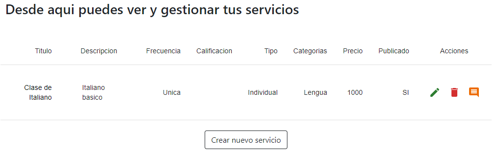

Haremos click en ese icono para listar debajo los comentarios pendientes.

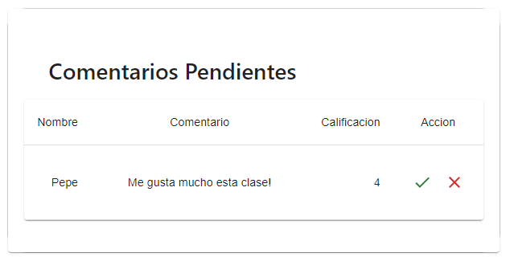

Para poder aprobar o rechazar el comentario, bastará con darle al tick verde o a la cruz roja respectivamente. Una vez revisado el comentario, de ser aprobado, se verá reflejado en el servicio.

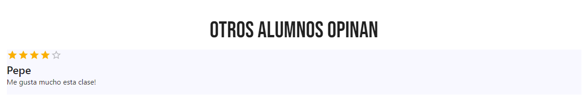

### Busqueda de servicios

Para la busqueda de servicios tendremos que ir a "Mercado". 

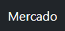

Podemos obserbar un listado de todos los servicios disponibles (los que fueron marcados como publicados por su autor). 

Del lado izquierdo, contamos con un sidebar para aplicar filtros sobre estos servicios, los cuales son basados por Calificación, Frecuencia, Tipo de clase y Categoria.

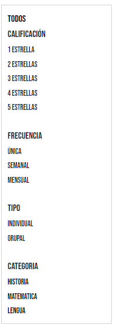

Este filtro permite activar varios al mismo tiempo, los cuales se irán listando en la parte superior del sidebar.

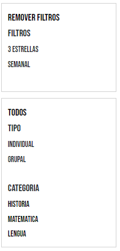

Para remover un filtro aplicado, bastará con hacerle click a ese filtro en especifico para removerlo. En caso de querer reiniciar la busqueda, al hacer click en el boton "Remover Filtros" se reiniciarán los filtros aplicados.

### Comentar un servicio

Para poder realizar una valoracion dentro de un servicio, hay que entrar a alguno de los servicios. 

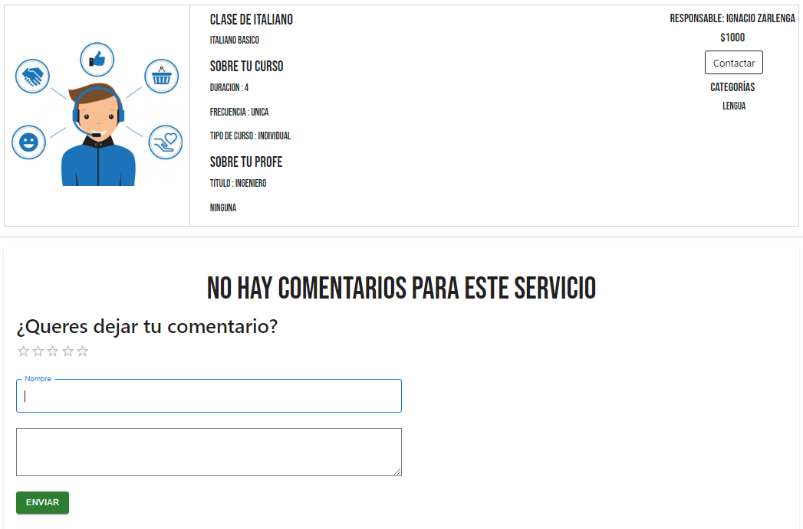

Al fondo, podremos observar una caja para realizar un comentario, en la cual se puede agregar una valoración de entre 1 y 5 estrellas, pudiendo aplicar medias estrellas tambien. Además, se deberá ingresar un nombre y un mensaje para la valoración. Una vez conforme con el comentario, se podrá enviar. Este mensaje no se mostrará ya que primero deberá ser revisado por el responsable del servicio.

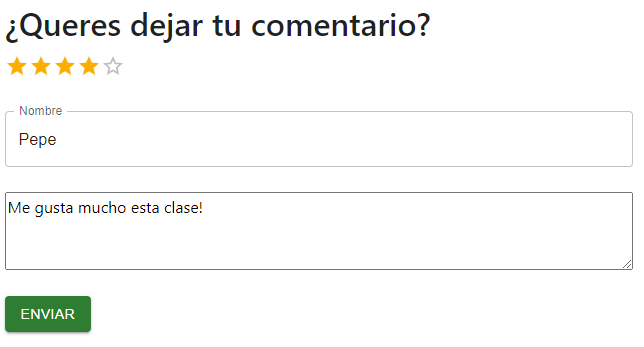

### Contratar un servicio

Para poder contratar un servicio, podemos observar que en la información de curso dentro del servicio hay un boton para contactar al responsable. Daremos click en dicho botón.

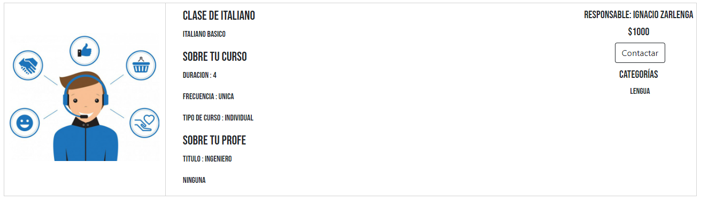

Nos aparecerá un formulario para rellenar con la información del solicitante, el cual requiere de un mail, DNI, teléfono y un mensaje al responsable en el cual podrá especificar alguna limitación a la hora de que el responsable se ponga en contacto con el solicitante (Por ejemplo, una limitante horaria). 

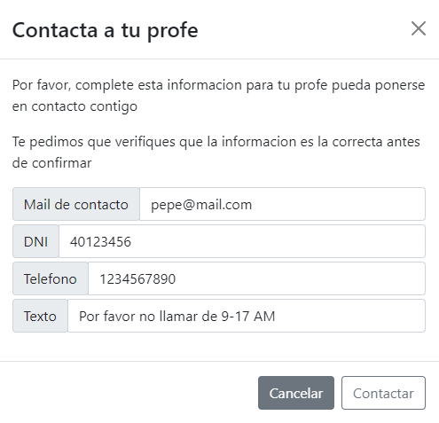

Una vez contentos con la información ingresada, daremos en el boton "Contactar" del formulario y la solicitud será enviada al responsable para que se maneje por fuera del marketplace el brindado del servicio.

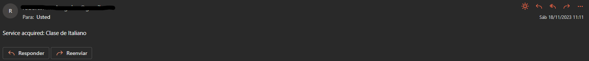
