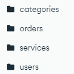
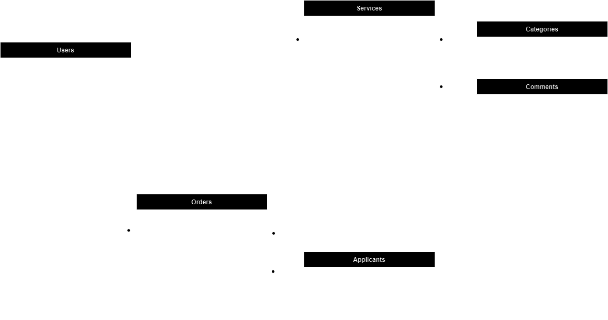

# Proyecto Backend

## Instalación y configuración

1. Dentro de una consola en este directorio, instalar las dependencias

    ```bash
    npm install
    ```
    ó
    ```bash
    yarn install
    ```

2. Dentro de la carpeta src, crearemos un archivo .env el cual debera tener el siguiente formato:

    ```bash
    REMOTEMONGODB_CNXSTRING = 'mongodb+srv://<username>:<password>@beyondthebasics.abcde.mongodb.net/'
    LOCALMONGODB_CNXSTRING = 'mongodb://localhost:27017/'
    MONGODB_DBNAME = '<database>'
    SESSION_SECRET = '<SECRET>'
    NODEMAILER_USER = 'user@gmail.com'
    NODEMAILER_PASS = 'gmail token'
    ```

    Importante: Setear desde la cuenta deseada de gmail el token necesario para configurar el servicio de mailing. [KB informativo](https://www.freecodecamp.org/espanol/news/como-usar-nodemailer-para-enviar-correos-electronicos-desde-tu-servidor-node-js/)


3. Una vez instaladas todas las dependencias, inicializar el proyecto 

    ```bash
    npm start
    ```
    ó
    ```bash
    yarn start
    ```

    Adicionalmente, se puede editar el package.json para agregar variables al momento de ejecucion. Se agrego el parametro modo para correr los modos de ejecucion como Cluster y Fork para poder levantar mas de una instancia en simultaneo (El default es fork). Otro paramentro ingresado es el "port" para poder especificar puertos especificos para la API (Tener en cuenta esto para el front, el cual apunta por defecto al 8080). El tercer parametro ingresado es el "env", dedicado a definir si se esta corriendo en ambiente de development o production (En el archivo config/config.js podran cambiar variables globales en base a esta decision, por default está en development).

## Documentación

### Endpoints

La documentación de los endpoints esta detallada en el siguiente link de [Postman](https://documenter.getpostman.com/view/30943389/2s9YXe8PrP).


### MongoDB

La base de datos debera contar con las siguientes collections y estructuras dadas para su correcto funcionamiento:

#### Collections

Unicamente contaremos con las siguientes collections:

- Users
- Services
- Orders
- Categories



#### DER

Las estructuras necesarias seran mas, pero dado a que contamos con los nested documents, no son necesarias mas collections que las antes mencionadas.


